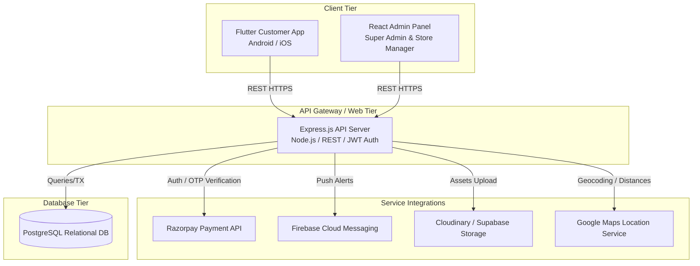
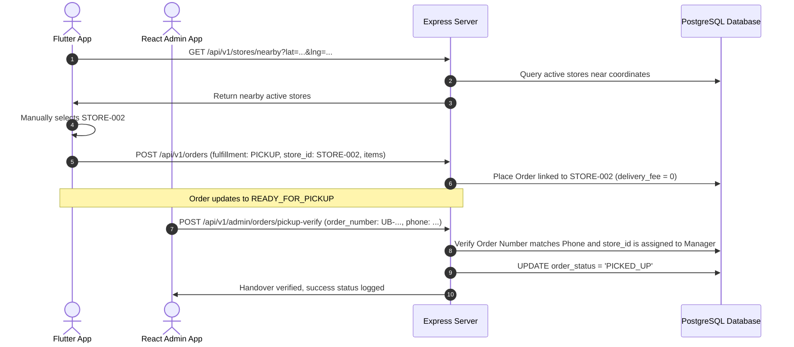
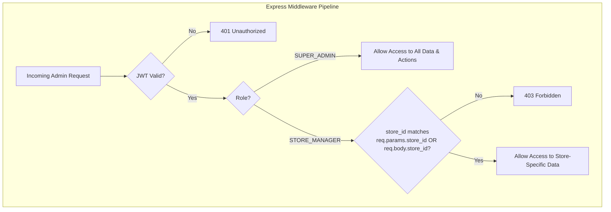
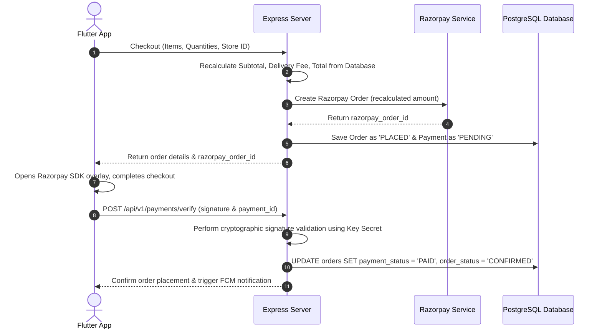
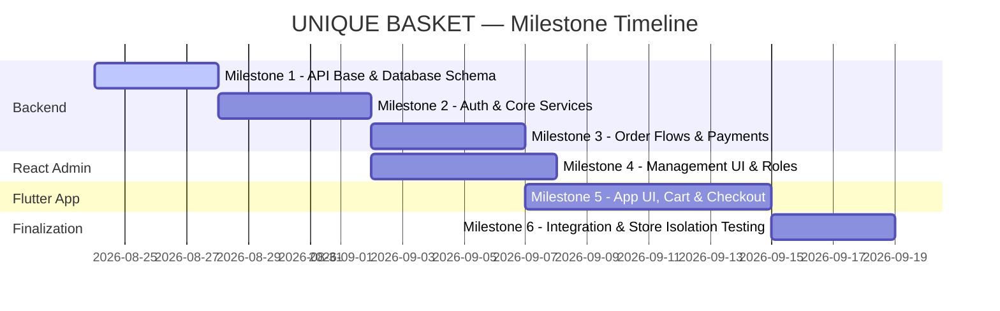

# UNIQUE BASKET — Architecture & System Design Plan

> **HISTORICAL DOCUMENT — not maintained.** It may describe plans, providers or behaviour that do not match the current code (e.g. Razorpay in the app, 6-digit OTP, route guards).
> Current implementation: `docs/CURRENT_STATE.md` · Decisions: `docs/DECISIONS.md` · Backlog: `docs/TASKS.md`.

This document outlines the detailed system architecture, database design, API specifications, security model, development roadmap, and testing strategies for **UNIQUE BASKET**, a multi-store online fruit and vegetable ordering platform.

---

## 1. Final Architecture

The platform follows a classic decoupled client-server architecture designed for high scalability, fault tolerance, and clear isolation of concerns.



### Architectural Highlights
- **Backend (API Server)**: Node.js with Express.js. Structured around a layered architecture: **Route Handler -> Middleware (Auth, Validation) -> Controller -> Service -> Repository (Prisma/Knex/Raw PG)**.
- **Admin Panel**: React.js with Tailwind CSS, built with a component-driven structure and protected context-based routing.
- **Customer App**: Flutter + Dart. We will adopt the **Repository-Service-Controller/Notifier (Riverpod)** pattern to maintain state isolation, caching, and clean UI code.
- **Database**: PostgreSQL with transactional safety. For geographic queries, we will use the standard **Haversine formula** implemented directly in PostgreSQL SQL functions, keeping the system portable without requiring heavy spatial extensions (PostGIS) unless needed later.

---

## 2. Complete Folder Structure

Below is the repository organization representing the three core components.

```
unique-basket/
├── backend/                  # Node.js + Express.js API Backend
│   ├── src/
│   │   ├── config/           # Database, Firebase, Razorpay configurations
│   │   ├── controllers/      # Route controllers (request handling & response)
│   │   ├── middlewares/      # Authentication, RBAC, Validation, Error Handler
│   │   ├── models/           # Prisma schema or database model definitions
│   │   ├── repositories/     # Database queries / direct DB access abstraction
│   │   ├── services/         # Core business logic (OTP, Store selection, Order TX)
│   │   ├── utils/            # Helper functions (Distance, OTP generators, Logger)
│   │   ├── routes/           # Express routing definition (V1)
│   │   └── app.js            # Express application entry point
│   ├── prisma/               # Prisma ORM setup (migration files & schemas)
│   │   └── schema.prisma
│   ├── tests/                # Jest integration and unit tests
│   ├── .env.example
│   ├── package.json
│   └── README.md
│
├── admin/                    # React.js + Tailwind CSS Admin Panel
│   ├── public/
│   ├── src/
│   │   ├── assets/           # Images, Logos
│   │   ├── components/       # Reusable UI parts (Tables, Forms, Modals, Badges)
│   │   ├── context/          # Auth Context, Store Context
│   │   ├── hooks/            # Custom hooks (e.g., useFetch, useAuth)
│   │   ├── layouts/          # Layout variants (DashboardLayout, AuthLayout)
│   │   ├── pages/            # View components (Dashboard, Orders, Inventory, Stores)
│   │   ├── services/         # API integrations (axios clients)
│   │   ├── utils/            # Helpers (Date formatters, currency formatters)
│   │   ├── types/            # TypeScript definitions (if using TS)
│   │   ├── App.js            # Route configurations and provider wrapping
│   │   └── index.css         # Tailwind directives & design tokens
│   ├── package.json
│   ├── tailwind.config.js
│   └── README.md
│
└── customer_app/             # Flutter Customer Mobile Application
    ├── android/
    ├── ios/
    ├── assets/
    │   ├── images/           # Logo, Onboarding graphics
    │   └── fonts/            # Custom branding fonts (e.g., Inter, Outfit)
    ├── lib/
    │   ├── core/
    │   │   ├── theme/        # App styling, Colors, Typography
    │   │   ├── constants/    # API endpoints, String labels
    │   │   └── utils/        # Geolocation, storage helpers, formatters
    │   ├── data/
    │   │   ├── models/       # Data transfer objects (User, Store, Product, Order)
    │   │   ├── sources/      # Direct API clients (HTTP calls)
    │   │   └── repositories/ # Data repository implementations
    │   ├── domain/
    │   │   └── providers/    # Riverpod state providers (Auth, Cart, Location)
    │   ├── presentation/
    │   │   ├── screens/      # Feature screens (Splash, Login, Home, Checkout)
    │   │   └── widgets/      # Shared components (ProductCard, CartSummary, Buttons)
    │   └── main.dart         # Flutter entry point
    ├── pubspec.yaml
    └── README.md
```

---

## 3. Database ER Diagram

The database structure preserves strict constraints, relationships, and transactional audit trails.

```mermaid
erDiagram
    USERS ||--o{ USER_ADDRESSES : "has"
    USERS ||--o{ ORDERS : "places"
    USERS ||--o{ DEVICE_TOKENS : "registers"
    
    STORES ||--o{ STORE_MANAGERS : "managed_by"
    STORES ||--o{ STORE_INVENTORY : "tracks"
    STORES ||--o{ ORDERS : "fulfills"
    
    ADMIN_USERS ||--o{ STORE_MANAGERS : "operates_as"
    
    CATEGORIES ||--o{ PRODUCTS : "groups"
    
    PRODUCTS ||--o{ STORE_INVENTORY : "present_in"
    PRODUCTS ||--o{ ORDER_ITEMS : "details"
    
    ORDERS ||--|{ ORDER_ITEMS : "contains"
    ORDERS ||--|| PAYMENTS : "billed_by"
    
    USER_ADDRESSES ||--o{ ORDERS : "delivered_to"

    USERS {
        uuid id PK
        varchar phone UNIQUE
        varchar name
        timestamp created_at
        timestamp updated_at
    }

    USER_ADDRESSES {
        uuid id PK
        uuid user_id FK
        varchar title
        varchar address_line
        varchar city
        varchar state
        varchar pincode
        decimal latitude
        decimal longitude
        boolean is_default
        timestamp created_at
    }

    STORES {
        uuid id PK
        varchar store_id UNIQUE "e.g. STORE-001"
        varchar name
        varchar address
        varchar city
        varchar state
        varchar pincode
        decimal latitude
        decimal longitude
        varchar phone
        varchar email
        time opening_time
        time closing_time
        boolean is_active
        timestamp created_at
    }

    ADMIN_USERS {
        uuid id PK
        varchar email UNIQUE
        varchar password_hash
        varchar name
        varchar role "SUPER_ADMIN | STORE_MANAGER"
        boolean is_active
        timestamp created_at
    }

    STORE_MANAGERS {
        uuid id PK
        uuid admin_user_id FK
        uuid store_id FK
        timestamp assigned_at
    }

    CATEGORIES {
        uuid id PK
        varchar name UNIQUE
        varchar image_url
        integer display_order
        boolean is_active
    }

    PRODUCTS {
        uuid id PK
        varchar name
        text description
        varchar category_id FK
        varchar unit "KG | GRAM | PIECE | PACK | DOZEN"
        decimal price
        decimal mrp
        boolean is_active
        timestamp created_at
    }

    STORE_INVENTORY {
        uuid id PK
        uuid store_id FK
        uuid product_id FK
        decimal stock_quantity "Allows decimal e.g. 50.5"
        decimal low_stock_threshold
        boolean is_available
        timestamp updated_at
        UNIQUE(store_id, product_id)
    }

    ORDERS {
        uuid id PK
        varchar order_number UNIQUE "UB-YYYYMMDD-001"
        uuid user_id FK
        uuid store_id FK
        varchar fulfillment_type "DELIVERY | PICKUP"
        uuid address_id FK "Null if PICKUP"
        decimal subtotal
        decimal delivery_fee
        decimal discount
        decimal total
        varchar payment_method "COD | ONLINE"
        varchar payment_status "PENDING | PAID | FAILED"
        varchar order_status "PLACED | CONFIRMED | PREPARING | READY_FOR_PICKUP | OUT_FOR_DELIVERY | DELIVERED | CANCELLED"
        timestamp created_at
        timestamp updated_at
    }

    ORDER_ITEMS {
        uuid id PK
        uuid order_id FK
        uuid product_id FK
        decimal quantity "Allows decimal e.g. 1.5 KG"
        decimal unit_price
        decimal total_price
    }

    PAYMENTS {
        uuid id PK
        uuid order_id FK
        varchar razorpay_order_id UNIQUE
        varchar razorpay_payment_id
        varchar razorpay_signature
        decimal amount
        varchar status
        timestamp created_at
    }

    DEVICE_TOKENS {
        uuid id PK
        uuid user_id FK "Null for guest / unauthenticated store devices"
        uuid admin_user_id FK "Null for clients"
        varchar token UNIQUE
        varchar platform "ANDROID | IOS | WEB"
        timestamp updated_at
    }
```

---

## 4. Complete Database Schema (DDL Definitions)

```sql
CREATE EXTENSION IF NOT EXISTS "uuid-ossp";

-- USERS
CREATE TABLE users (
    id UUID PRIMARY KEY DEFAULT uuid_generate_v4(),
    phone VARCHAR(15) UNIQUE NOT NULL,
    name VARCHAR(100),
    created_at TIMESTAMP WITH TIME ZONE DEFAULT CURRENT_TIMESTAMP,
    updated_at TIMESTAMP WITH TIME ZONE DEFAULT CURRENT_TIMESTAMP
);

-- USER ADDRESSES
CREATE TABLE user_addresses (
    id UUID PRIMARY KEY DEFAULT uuid_generate_v4(),
    user_id UUID REFERENCES users(id) ON DELETE CASCADE,
    title VARCHAR(50) NOT NULL, -- e.g., 'Home', 'Office'
    address_line TEXT NOT NULL,
    city VARCHAR(100) NOT NULL,
    state VARCHAR(100) NOT NULL,
    pincode VARCHAR(10) NOT NULL,
    latitude DECIMAL(10, 8) NOT NULL,
    longitude DECIMAL(11, 8) NOT NULL,
    is_default BOOLEAN DEFAULT false,
    created_at TIMESTAMP WITH TIME ZONE DEFAULT CURRENT_TIMESTAMP,
    updated_at TIMESTAMP WITH TIME ZONE DEFAULT CURRENT_TIMESTAMP
);

-- STORES
CREATE TABLE stores (
    id UUID PRIMARY KEY DEFAULT uuid_generate_v4(),
    store_id VARCHAR(50) UNIQUE NOT NULL,
    name VARCHAR(100) NOT NULL,
    address TEXT NOT NULL,
    city VARCHAR(100) NOT NULL,
    state VARCHAR(100) NOT NULL,
    pincode VARCHAR(10) NOT NULL,
    latitude DECIMAL(10, 8) NOT NULL,
    longitude DECIMAL(11, 8) NOT NULL,
    phone VARCHAR(15) NOT NULL,
    email VARCHAR(100),
    opening_time TIME NOT NULL,
    closing_time TIME NOT NULL,
    is_active BOOLEAN DEFAULT true,
    created_at TIMESTAMP WITH TIME ZONE DEFAULT CURRENT_TIMESTAMP,
    updated_at TIMESTAMP WITH TIME ZONE DEFAULT CURRENT_TIMESTAMP
);

-- ADMIN USERS
CREATE TABLE admin_users (
    id UUID PRIMARY KEY DEFAULT uuid_generate_v4(),
    email VARCHAR(100) UNIQUE NOT NULL,
    password_hash VARCHAR(255) NOT NULL,
    name VARCHAR(100) NOT NULL,
    role VARCHAR(20) CHECK (role IN ('SUPER_ADMIN', 'STORE_MANAGER')) NOT NULL,
    is_active BOOLEAN DEFAULT true,
    created_at TIMESTAMP WITH TIME ZONE DEFAULT CURRENT_TIMESTAMP,
    updated_at TIMESTAMP WITH TIME ZONE DEFAULT CURRENT_TIMESTAMP
);

-- STORE MANAGERS
CREATE TABLE store_managers (
    id UUID PRIMARY KEY DEFAULT uuid_generate_v4(),
    admin_user_id UUID REFERENCES admin_users(id) ON DELETE CASCADE NOT NULL,
    store_id UUID REFERENCES stores(id) ON DELETE CASCADE NOT NULL,
    assigned_at TIMESTAMP WITH TIME ZONE DEFAULT CURRENT_TIMESTAMP,
    UNIQUE(admin_user_id, store_id)
);

-- CATEGORIES
CREATE TABLE categories (
    id UUID PRIMARY KEY DEFAULT uuid_generate_v4(),
    name VARCHAR(100) UNIQUE NOT NULL,
    image_url TEXT,
    display_order INT DEFAULT 0,
    is_active BOOLEAN DEFAULT true,
    created_at TIMESTAMP WITH TIME ZONE DEFAULT CURRENT_TIMESTAMP
);

-- PRODUCTS
CREATE TABLE products (
    id UUID PRIMARY KEY DEFAULT uuid_generate_v4(),
    name VARCHAR(100) NOT NULL,
    description TEXT,
    category_id UUID REFERENCES categories(id) ON DELETE RESTRICT,
    unit VARCHAR(10) CHECK (unit IN ('KG', 'GRAM', 'PIECE', 'PACK', 'DOZEN')) DEFAULT 'KG',
    price DECIMAL(10, 2) NOT NULL,
    mrp DECIMAL(10, 2),
    is_active BOOLEAN DEFAULT true,
    created_at TIMESTAMP WITH TIME ZONE DEFAULT CURRENT_TIMESTAMP,
    updated_at TIMESTAMP WITH TIME ZONE DEFAULT CURRENT_TIMESTAMP
);

-- STORE INVENTORY
CREATE TABLE store_inventory (
    id UUID PRIMARY KEY DEFAULT uuid_generate_v4(),
    store_id UUID REFERENCES stores(id) ON DELETE CASCADE NOT NULL,
    product_id UUID REFERENCES products(id) ON DELETE CASCADE NOT NULL,
    stock_quantity DECIMAL(10, 3) DEFAULT 0.000 NOT NULL,
    low_stock_threshold DECIMAL(10, 3) DEFAULT 5.000,
    is_available BOOLEAN DEFAULT true,
    updated_at TIMESTAMP WITH TIME ZONE DEFAULT CURRENT_TIMESTAMP,
    UNIQUE(store_id, product_id)
);

-- ORDERS
CREATE TABLE orders (
    id UUID PRIMARY KEY DEFAULT uuid_generate_v4(),
    order_number VARCHAR(30) UNIQUE NOT NULL,
    user_id UUID REFERENCES users(id) ON DELETE RESTRICT NOT NULL,
    store_id UUID REFERENCES stores(id) ON DELETE RESTRICT NOT NULL,
    fulfillment_type VARCHAR(10) CHECK (fulfillment_type IN ('DELIVERY', 'PICKUP')) NOT NULL,
    address_id UUID REFERENCES user_addresses(id) ON DELETE RESTRICT,
    subtotal DECIMAL(10, 2) NOT NULL,
    delivery_fee DECIMAL(10, 2) NOT NULL,
    discount DECIMAL(10, 2) DEFAULT 0.00,
    total DECIMAL(10, 2) NOT NULL,
    payment_method VARCHAR(10) CHECK (payment_method IN ('COD', 'ONLINE')) NOT NULL,
    payment_status VARCHAR(20) CHECK (payment_status IN ('PENDING', 'PAID', 'FAILED')) DEFAULT 'PENDING' NOT NULL,
    order_status VARCHAR(30) CHECK (order_status IN ('PLACED', 'CONFIRMED', 'PREPARING', 'READY_FOR_PICKUP', 'OUT_FOR_DELIVERY', 'DELIVERED', 'CANCELLED')) DEFAULT 'PLACED' NOT NULL,
    created_at TIMESTAMP WITH TIME ZONE DEFAULT CURRENT_TIMESTAMP,
    updated_at TIMESTAMP WITH TIME ZONE DEFAULT CURRENT_TIMESTAMP
);

-- ORDER ITEMS
CREATE TABLE order_items (
    id UUID PRIMARY KEY DEFAULT uuid_generate_v4(),
    order_id UUID REFERENCES orders(id) ON DELETE CASCADE NOT NULL,
    product_id UUID REFERENCES products(id) ON DELETE RESTRICT NOT NULL,
    quantity DECIMAL(10, 3) NOT NULL,
    unit_price DECIMAL(10, 2) NOT NULL,
    total_price DECIMAL(10, 2) NOT NULL
);

-- PAYMENTS
CREATE TABLE payments (
    id UUID PRIMARY KEY DEFAULT uuid_generate_v4(),
    order_id UUID REFERENCES orders(id) ON DELETE RESTRICT NOT NULL,
    razorpay_order_id VARCHAR(100) UNIQUE NOT NULL,
    razorpay_payment_id VARCHAR(100),
    razorpay_signature VARCHAR(255),
    amount DECIMAL(10, 2) NOT NULL,
    status VARCHAR(50) NOT NULL,
    created_at TIMESTAMP WITH TIME ZONE DEFAULT CURRENT_TIMESTAMP
);

-- DEVICE TOKENS
CREATE TABLE device_tokens (
    id UUID PRIMARY KEY DEFAULT uuid_generate_v4(),
    user_id UUID REFERENCES users(id) ON DELETE CASCADE,
    admin_user_id UUID REFERENCES admin_users(id) ON DELETE CASCADE,
    token TEXT UNIQUE NOT NULL,
    platform VARCHAR(20) CHECK (platform IN ('ANDROID', 'IOS', 'WEB')) NOT NULL,
    updated_at TIMESTAMP WITH TIME ZONE DEFAULT CURRENT_TIMESTAMP
);

-- SYSTEM SETTINGS (Delivery configurations)
CREATE TABLE delivery_settings (
    id UUID PRIMARY KEY DEFAULT uuid_generate_v4(),
    delivery_fee DECIMAL(10, 2) NOT NULL DEFAULT 30.00,
    free_delivery_threshold DECIMAL(10, 2) NOT NULL DEFAULT 499.00,
    updated_at TIMESTAMP WITH TIME ZONE DEFAULT CURRENT_TIMESTAMP
);

-- BANNERS
CREATE TABLE banners (
    id UUID PRIMARY KEY DEFAULT uuid_generate_v4(),
    title VARCHAR(100),
    image_url TEXT NOT NULL,
    display_order INT DEFAULT 0,
    is_active BOOLEAN DEFAULT true,
    created_at TIMESTAMP WITH TIME ZONE DEFAULT CURRENT_TIMESTAMP
);

-- INDEXES
CREATE INDEX idx_stores_location ON stores(latitude, longitude);
CREATE INDEX idx_user_addresses_location ON user_addresses(latitude, longitude);
CREATE INDEX idx_orders_user_id ON orders(user_id);
CREATE INDEX idx_orders_store_id ON orders(store_id);
CREATE INDEX idx_order_items_order_id ON order_items(order_id);
CREATE INDEX idx_inventory_store_prod ON store_inventory(store_id, product_id);
```

---

## 5. Database Relationships & Constraints

- **Transactional Consistency**: If inventory drops below selected levels or orders are verified, modifications to `store_inventory` and creation of `orders` and `order_items` run inside a strict **SQL TRANSACTION** (Read Committed isolation minimum).
- **Referential Integrity**: Important entities are secured against accidental cascade deletions (`ON DELETE RESTRICT` for `orders.user_id`, `orders.store_id`, `orders.address_id`, and `order_items.product_id`). Device tokens and address tables clear themselves when parent entities disappear.
- **Unique Identifiers**: Standard PostgreSQL UUIDs are used internally for indexing security. Order numbers utilize the string identifier `UB-YYYYMMDD-[Sequence]`. This is built via a DB helper mapping to prevent ID collision.

---

## 6. Complete API List

All requests and responses use JSON. Unhandled exceptions are converted into standardized JSON errors without leaking stack traces.

### A. Authentication API (`/api/v1/auth`)
- **`POST /api/v1/auth/send-otp`**
  - *Request*: `{ "phone": "+919876543210" }`
  - *Response*: `{ "success": true, "message": "OTP sent successfully" }` (Mock gateway returns simulated OTP in dev/staging).
- **`POST /api/v1/auth/verify-otp`**
  - *Request*: `{ "phone": "+919876543210", "otp": "123456" }`
  - *Response*: `{ "success": true, "data": { "user": { "id": "...", "phone": "...", "name": "..." }, "token": "JWT_ACCESS_TOKEN", "refreshToken": "JWT_REFRESH_TOKEN" } }`
- **`POST /api/v1/auth/refresh`**
  - *Request*: `{ "refreshToken": "..." }`
  - *Response*: `{ "success": true, "data": { "token": "NEW_ACCESS_TOKEN" } }`
- **`POST /api/v1/auth/logout`**
  - *Request*: `{}` (Header: JWT Token)
  - *Response*: `{ "success": true, "message": "Logged out successfully" }`

### B. User Profile & Address APIs (`/api/v1/users` & `/api/v1/addresses`)
- **`GET /api/v1/users/me`** (Protected)
  - *Response*: `{ "success": true, "data": { "id": "...", "phone": "...", "name": "..." } }`
- **`PUT /api/v1/users/me`** (Protected)
  - *Request*: `{ "name": "New Name" }`
  - *Response*: `{ "success": true, "data": { "id": "...", "phone": "...", "name": "New Name" } }`
- **`GET /api/v1/addresses`** (Protected)
  - *Response*: `{ "success": true, "data": [{ "id": "...", "title": "Home", "address_line": "...", "latitude": 12.9716, "longitude": 77.5946, "is_default": true }] }`
- **`POST /api/v1/addresses`** (Protected)
  - *Request*: `{ "title": "Home", "address_line": "...", "city": "Bangalore", "state": "Karnataka", "pincode": "560001", "latitude": 12.9716, "longitude": 77.5946, "is_default": true }`
  - *Response*: `{ "success": true, "data": { ... } }`
- **`PUT /api/v1/addresses/:id`** (Protected)
  - *Request*: `{ "address_line": "Updated Street Name" }`
  - *Response*: `{ "success": true, "data": { ... } }`
- **`DELETE /api/v1/addresses/:id`** (Protected)
  - *Response*: `{ "success": true, "message": "Address deleted" }`

### C. Stores & Inventory APIs (`/api/v1/stores`)
- **`GET /api/v1/stores/nearby`**
  - *Query Params*: `?lat=12.9716&lng=77.5946`
  - *Response*: `{ "success": true, "data": [{ "id": "...", "store_id": "STORE-001", "name": "...", "distance_km": 2.1, "is_active": true }] }`
- **`GET /api/v1/stores/:id/products`**
  - *Query Params*: `?category_id=...&page=1&limit=20`
  - *Response*: `{ "success": true, "data": [{ "id": "...", "name": "Apple", "price": 120.00, "unit": "KG", "stock_quantity": 45.0, "is_available": true }] }`

### D. Products & Categories APIs (`/api/v1/products` & `/api/v1/categories`)
- **`GET /api/v1/categories`**
  - *Response*: `{ "success": true, "data": [{ "id": "...", "name": "Fruits", "image_url": "..." }] }`
- **`GET /api/v1/products/:id`**
  - *Response*: `{ "success": true, "data": { "id": "...", "name": "Banana", "description": "...", "unit": "KG", "price": 40.00 } }`

### E. Checkout & Order APIs (`/api/v1/orders`)
- **`POST /api/v1/orders`** (Protected)
  - *Request*:
    ```json
    {
      "fulfillment_type": "DELIVERY",
      "address_id": "ADDRESS_UUID",
      "store_id": "STORE_UUID",
      "payment_method": "ONLINE",
      "items": [
        { "product_id": "PRODUCT_UUID", "quantity": 1.5 }
      ]
    }
    ```
  - *Response*:
    ```json
    {
      "success": true,
      "data": {
        "order": {
          "id": "ORDER_UUID",
          "order_number": "UB-20260823-001",
          "total": 210.00,
          "payment_status": "PENDING"
        },
        "razorpay_order": {
          "id": "order_Rp123xyz",
          "amount": 21000,
          "currency": "INR"
        }
      }
    }
    ```
- **`GET /api/v1/orders`** (Protected - Customer views history)
- **`GET /api/v1/orders/:id`** (Protected)
- **`POST /api/v1/orders/:id/cancel`** (Protected - Restricts if already Preparing/Out for Delivery)

### F. Razorpay Integration APIs (`/api/v1/payments`)
- **`POST /api/v1/payments/verify`** (Protected)
  - *Request*: `{ "razorpay_order_id": "...", "razorpay_payment_id": "...", "razorpay_signature": "..." }`
  - *Response*: `{ "success": true, "message": "Payment verified and order confirmed" }`
- **`POST /api/v1/payments/webhook`** (Public - Verified via HMAC signature verification)
  - Handles async payment confirmation and failure payloads.

### G. Admin APIs (`/api/v1/admin`)
- **`POST /api/v1/admin/login`**
  - *Response*: JWT Token containing admin roles and store permissions.
- **`GET /api/v1/admin/orders`** (Store-isolated)
  - Super Admin sees all; Store Manager sees only orders matching their assigned store ID.
- **`POST /api/v1/admin/orders/:id/status`** (Store-isolated)
  - Updates order status: PLACED -> CONFIRMED -> PREPARING -> READY_FOR_PICKUP/OUT_FOR_DELIVERY -> DELIVERED/PICKED_UP.
- **`POST /api/v1/admin/orders/pickup-verify`** (Store-isolated)
  - *Request*: `{ "order_number": "UB-20260823-001", "phone": "+919876543210" }`
  - *Response*: Marks order as PICKED_UP and triggers success notification.
- **`GET /api/v1/admin/inventory`** (Store-isolated)
- **`PUT /api/v1/admin/inventory/:product_id`** (Store-isolated)
- **`POST /api/v1/admin/stores`** (Super Admin only)
- **`POST /api/v1/admin/products`** (Super Admin only)

---

## 7. Core Workflows

### Authentication Flow (Mobile OTP)
1. Customer enters Mobile Number in Flutter App.
2. Flutter Client sends API request to backend.
3. Backend validates phone format, creates a 6-digit OTP, stores it hashed in Cache/DB with a 5-minute expiry, and triggers the SMS gateway.
4. User inputs OTP. App hits `/api/v1/auth/verify-otp`.
5. Backend verifies correct match and marks state. Generates a signed JWT access token (15 mins) and a secure refresh token (7 days).

---

### Home Delivery Store Selection & Order Flow

Automatic store selection is completely localized and based solely on geographical distance.

```mermaid
sequenceDiagram
    autonumber
    actor Customer as Flutter App
    participant Server as Express Server
    participant DB as PostgreSQL Database

    Customer->>Server: POST /api/v1/addresses (Save Address coords)
    Server->>DB: INSERT address (Lat, Lng)
    Customer->>Server: GET /api/v1/stores/nearby (Lat, Lng)
    DB->>Server: Query active stores + Calculate Haversine distance
    Server->>Customer: Return active stores sorted by distance
    Note over Customer, Server: Store assignment is based strictly on proximity
    Customer->>Server: POST /api/v1/orders (address_id, items)
    Server->>DB: Query nearest active store based on Address coordinates
    DB->>Server: Returns nearest store ID (e.g. STORE-001)
    Server->>Server: Calculate Total, verify pricing & inventory at nearest store
    Server->>DB: START TRANSACTION; create Order & bind store_id permanently
    Server->>DB: Commit Transaction
    Server->>Customer: Order created, return Order ID & Razorpay Order details
```

---

### Store Pickup Flow & Verification

For store pickup, the customer manually selects from a list of nearby stores, bypasses delivery charge fees, and verifies their pickup at the store counters.



---

## 8. Role & Permission Security Model

We enforce strict authentication boundaries. The **Store Manager**'s identity contains an association with their assigned store in the database.



### Access Matrix
| Operations / API Resource | Super Admin | Store Manager (STORE-001) | Store Manager (STORE-002) |
|---|---|---|---|
| Create Store / Edit store locations | ✅ | ❌ | ❌ |
| Add Global Products / Manage Categories | ✅ | ❌ | ❌ |
| View Inventory | ✅ (All) | ✅ (Only STORE-001) | ✅ (Only STORE-002) |
| Update Inventory Quantity | ✅ (All) | ✅ (Only STORE-001) | ✅ (Only STORE-002) |
| View Orders | ✅ (All) | ✅ (Only STORE-001) | ✅ (Only STORE-002) |
| Complete Store Pickup Verification | ✅ (All) | ✅ (Only STORE-001) | ✅ (Only STORE-002) |
| Configure Delivery Fees / Banners | ✅ | ❌ | ❌ |

---

## 9. Razorpay Payment Architecture

To prevent fraud or client-side bypasses, order totals are re-calculated and verified server-side.



- **Fail-safe Webhooks**: In case the customer closes the app immediately after paying, Razorpay sends an asynchronous webhook event (`payment.captured`) to `/api/v1/payments/webhook`. The backend validates the webhook's signature, loads the corresponding order, and updates the payment/order status.

---

## 10. Firebase Notification Architecture

We map device tokens to users and admin roles to target messaging:
- **Topics**: Admins and Store Managers can subscribe to store-specific FCM topics (e.g., topic: `orders_STORE-001`). When a customer places a delivery or pickup order, the backend pushes a notification to the topic associated with that store.
- **Direct Tokens**: During execution of order status updates (e.g., OUT_FOR_DELIVERY, READY_FOR_PICKUP), the backend looks up all active `device_tokens` for the user associated with that order, sending targeted push notifications.

---

## 11. Deployment Architecture

Deployments utilize standard cloud-native environments:
- **Database**: PostgreSQL hosted on **Supabase** or **Render** with active automated backups and indexing.
- **Backend API**: Node.js app containerized via Docker and deployed on **Railway** or **Render** behind an SSL certificate wrapper. Standard logging via `winston` logs to files.
- **Admin Dashboard**: Deployed as static HTML/JS assets on **Vercel** or **Netlify** with environment configuration injecting the staging/production API endpoints during build.
- **Mobile Assets**: Images stored in **Cloudinary** or **Supabase Storage** bucket.

---

## 12. Development Roadmap

Our execution roadmap is divided into structured milestones:



---

## 13. Testing Strategy

1. **Store Isolation & Backend Verification**:
   - Write integration tests using `Supertest` to verify that hitting store endpoints (e.g., `/api/v1/admin/orders`) with a token belonging to `STORE-001`'s manager returns status `403 Forbidden` if requesting data for `STORE-002`.
2. **Automated API Testing**:
   - Coverage of transactional states during checkout. Validate that attempting to place an order when database inventories are lower than requested quantities triggers a descriptive error or adjusts items.
3. **Manual Verification & Staging**:
   - Establish simulated coordinates around targeted store locations to verify the Haversine distance calculator.
   - Run Razorpay in sandbox testing mode to evaluate all checkout and webhook failure scenarios.

---

## 14. Risks & Technical Considerations

- **Decimal Quantity Calculations**: Multi-unit fruit and vegetable operations require decimal numbers (e.g., `0.5 KG`). All inventory subtraction, cart summaries, and payment breakdowns must handle floating-point multiplication errors (e.g., `0.1 + 0.2 = 0.30000000000000004` in Javascript) by rounding totals carefully to exactly 2 decimal places (`.toFixed(2)` or database numeric casts).
- **Location Pin Accuracy**: GPS accuracy from customer address entry could place a user outside the delivery zone or adjacent to the wrong store. The frontend must implement Google Places Auto-complete and geolocation confirmation overlays.
- **Payment Success Webhook Delay**: Webhooks from Razorpay might arrive late. The database order statuses will support intermediate payment validation steps to prevent order processing duplication.

---

## 15. User Review Required / Open Questions

> [!IMPORTANT]
> Please review the following architectural decisions and provide feedback:
>
> 1. **SMS OTP Provider**: Which API provider should we integrate for sending OTPs in production (e.g., Msg91, Twilio, Firebase Auth)? For initial development, we will build a mock OTP handler.
> 2. **Image Storage Service**: We suggest Cloudinary or Supabase Storage. Do you have a preference or existing account?
> 3. **ORM/Query Builder**: We propose using **Prisma** or **Knex** for PostgreSQL interaction, which simplifies database migrations and structures. Do you have a preference?
> 4. **Location/Distance Logic**: We will calculate straight-line distances (Haversine formula). Is that acceptable, or do you require real-road network distance via Google Distance Matrix API (which requires an active API key billing)?

---

## Verification Plan

### Automated Verification
- We will set up integration tests inside the backend using Jest to run automated test cases.
- Run database migrations and seeders to assert structure validity.

### Manual Verification
- Deploying the backend API to a staging environment.
- Accessing the React Admin panel and creating test stores, categories, and products.
- Performing a complete checkout, payment, and store pickup verification loop.
